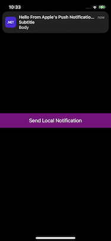
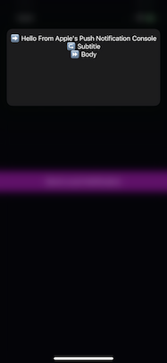

# User Notifications in iOS

User Notifications is a sample app that accompanies the article [User notifications](https://learn.microsoft.com/en-us/dotnet/ios/app-fundamentals/user-notifications/user-notifications).

It demonstrates how to delivery and handling of user notifications at runtime.

Note that running this example project locally requires creating new app
identifiers and provisioning profiles for both the main project and each app
extension project, and then updating the bundle identifier (the
`ApplicationId` in the project file) for each project according to the chosen
app identifier.

See the [User Notifications](https://learn.microsoft.com/en-us/dotnet/ios/app-fundamentals/user-notifications/user-notifications) article for more information.

## Local notifications

Clicking on the `Send Local Notification` button sends a local notification:

[](LocalNotification.png)

## Remote notification

Sending a remote notification (for instance using Apple's Push Notification Console):

[](RemoteNotification.png)

Example payload:

```json
{
	"aps": {
		"alert": {
			"title": "Hello From Apple's Push Notification Console",
			"subtitle": "Subtitle",
			"body": "Body" }
		}
}
```

## Modified remote notification using a Notification Service extension:

Sending a remote notification (for instance using Apple's Push Notification
Console), with the `mutable-content` key in the payload set to `1` makes the
iOS device deliver the notification to any Notification Service extensions,
which can modify the payload:

[](ModifiedRemoteNotification.png)

Example payload:

```json
{
	"aps": {
		"alert": {
			"title": "Hello From Apple's Push Notification Console",
			"subtitle": "Subtitle",
			"body": "Body" },
		"mutable-content": 1
		}
}
```


## Modified remote notification using a Notification Service extension:

If the user long-presses a notification, iOS can display an extended interface
for the notification if the app contains a Content Service extension:

[](CustomizedExpandedRemoteNotification.png)

This requires the `category` key in the payload to be set to a category listed in the `UNNotificationExtensionCategory` entry in the Notification Service extension's `Info.plist`.

Example payload:

```json
{
	"aps": {
		"alert": {
			"title": "Hello From Apple's Push Notification Console",
			"subtitle": "Subtitle",
			"body": "Body" },
		"category": "general"
		}
}
```

## Both extensions at the same time

Both a Notification Service extension and a Content Service extension can process a notification:

[](CustomizedExpandedModifiedRemoteNotification.png)

Example payload:

```json
{
	"aps": {
		"alert": {
			"title": "Hello From Apple's Push Notification Console",
			"subtitle": "Subtitle",
			"body": "Body" },
		"category": "general",
		"mutable-content": 1
		}
}
```
